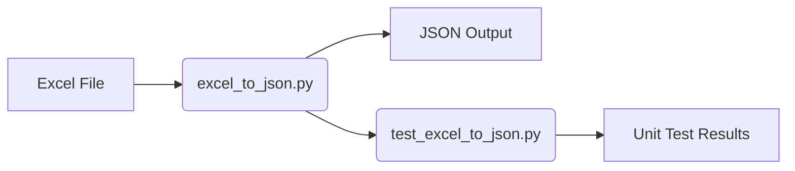

# Architecture
## Overview
The Excel to JSON converter is a Python application that reads an Excel file and converts its tabs to JSON format.

## Components
- `excel_to_json.py`: The main application file that performs the conversion.
- `test_excel_to_json.py`: The unit test file for the application.

## Architecture

## Usage
1. Install the required packages: `pandas`
2. Run the application: `python excel_to_json.py <excel_file_path>`
3. Run the unit tests: `python test_excel_to_json.py`